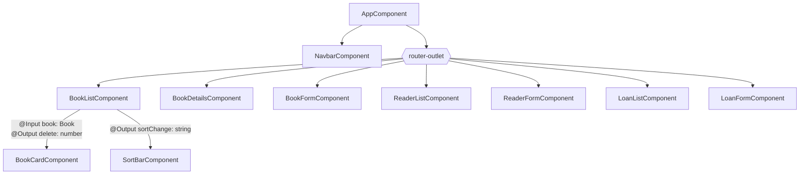

# Diagram komponentów

```mermaid
graph TD
    App[AppComponent] --> Navbar[NavbarComponent]
    App --> Router{{router-outlet}}

    Router --> BookList[BookListComponent]
    Router --> BookDetails[BookDetailsComponent]
    Router --> BookForm[BookFormComponent]
    Router --> ReaderList[ReaderListComponent]
    Router --> ReaderForm[ReaderFormComponent]
    Router --> LoanList[LoanListComponent]
    Router --> LoanForm[LoanFormComponent]

    BookList -->|"@Input book: Book<br>@Output delete: number"| BookCard[BookCardComponent]
    BookList -->|"@Output sortChange: string"| SortBar[SortBarComponent]
```
